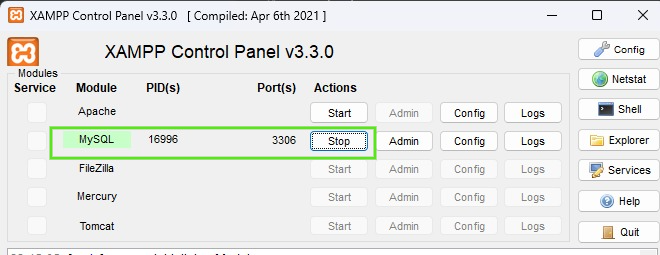

# 🛒 Projeto Final Geração Tech 3.0 - API Backend

Este repositório contém a infraestrutura de Back-end em **Node.js** desenvolvida como parte oficial do **Bootcamp Geração Tech 3.0** (Digital College). 

Esta API RESTful foi desenhada sob a arquitetura **MVC** para fornecer o motor completo de catálogo de produtos, filtragem avançada de vitrine e sistema de segurança (Login JWT) para o nosso Front-end (React).

## 👥 Autores

**Weber Fernandes**  
GitHub: [weberfern](https://github.com/weberfern)  
Email: [weber12@gmail.com](mailto:weber12@gmail.com)

**Sandra Vasconcelos**  
GitHub: [SandraVasconcelos-74](https://github.com/SandraVasconcelos-74)  
Email: [sandrajulala@gmail.com](mailto:sandrajulala@gmail.com)

**Assis Sousa**  
GitHub: [assissousa](https://github.com/assissousa)  
Email: [assispsousa@gmail.com](mailto:assispsousa@gmail.com)

---

## 🛠️ Tecnologias Utilizadas
- **Node.js & Express:** Roteamento rápido e construção do servidor central.
- **Sequelize ORM & MySQL:** Modelagem Orientada a Objetos para o banco de dados relacional.
- **JSON Web Token (JWT) & Bcrypt:** Autenticação e bloqueio de rotas privadas via criptografia.
- **Dotenv:** Proteção e ocultamento de variáveis de ambiente sensíveis à Nuvem.
- **Nodemon:** Hot-reloading imersivo durante o desenvolvimento.
- **Swagger:** Documentação interativa e testes de API.
- **Jest & Supertest:** Suíte de testes automatizados para validação de endpoints.

## 📂 Arquitetura de Pastas (Padrão MVC)
O projeto foi particionado focando a alta responsabilidade única de cada camada:
```text
├── src/
│   ├── config/       # Chaves e configurações de acesso ao Banco de Dados (database.js)
│   ├── controllers/  # Controladores da aplicação (Regras de negócio e Models)
│   ├── middleware/   # Componentes de segurança (Validação de JWT Header)
│   ├── migrations/   # Histórico arquitetural (Geração das Tabelas via CLI)
│   ├── models/       # Definição das Entidades (User, Category, Product)
│   ├── routes/       # Portas de Entrada da API mapeadas por verbos HTTP
│   ├── services/     # Serviços auxiliares e integrações
│   ├── app.js        # Configuração do Express e Middlewares
│   └── server.js     # Inicializador de escuta do Servidor
├── tests/            # Suíte de testes automatizados e integração
├── .env              # Variáveis de Ambiente
└── .sequelizerc      # Configurações do Sequelize CLI
```

## 🔐 End-Points e Rotas Protegidas
O motor da API divide as requisições em duas esferas claras de segurança:

### 🟢 Rotas Públicas (Vitrine Aberta)
- `GET /v1/status` (Verifica a saúde do servidor)
- `GET /v1/product/search` (Busca Inteligente por limite, offset de página e Match de Lupa)
- `GET /v1/product/:id` (Apresentação detalhada da galeria do produto e SKU/Opções)
- `GET /v1/category/search` (Apresenta o Menu Dinâmico)
- `POST /v1/user` (Cadastra novo cliente)
- `POST /v1/user/token` (Gera o token do cliente logado)

### 🔴 Rotas Privadas (Exigem Header `Authorization: Bearer <Token>`)
- `POST`, `PUT`, `DELETE` /v1/product (Permite o gerenciamento de produtos)
- `POST`, `PUT`, `DELETE` /v1/category (Permite o gerenciamento de categorias)
- `PUT`, `DELETE` /v1/user (Permite o gerenciamento de usuários)

---

## 🚀 Como Rodar o Projeto na sua Máquina

1. Clone o repositório na sua máquina local:
```bash
git clone https://github.com/weberfern/projeto-final-gtech-backend.git
```

2. Instale as dependências:
```bash
npm install
```

3. Base de Dados (MySQL):
- O projeto exige o uso de **MySQL** (conforme requisitos).
- **Ferramentas Recomendadas:**
  - **XAMPP:** [Baixar aqui](https://www.apachefriends.org/pt_br/index.html) (Gerenciador do Servidor Local).
  - **DBeaver:** [Baixar aqui](https://dbeaver.io/download/) (Visualizador do Banco de Dados).

- **Configuração Rápida:**
  1. No painel do **XAMPP**, clique em **Start** na linha do **MySQL**.
  2. Utilize o **DBeaver** para criar um banco de dados chamado `drip_store_db` no seu servidor local (localhost:3306). 
  3. Caso queira também utilizar um banco de dados para os testes automatizado crie outro chamado `drip_store_test`.

<p align="center">
  
</p>

- Crie um arquivo chamado `.env` na raiz do projeto conforme o padrão:
```env
DB_HOST=127.0.0.1
DB_USER=root
DB_PASSWORD=sua_senha
DB_NAME=drip_store_db
DB_TEST_NAME=drip_store_test
JWT_SECRET=SuaChaveSuperSecreta
JWT_EXPIRES_IN=1d
```
- Rode as *Migrations* para gerar as tabelas:
```bash
npx sequelize-cli db:migrate
```

4. Inicie o servidor:
```bash
npm start
```
Acesse `http://localhost:3000/v1/status` para validar o funcionamento.

---

## 📖 Documentação da API (Swagger)

A API conta com documentação interativa via **Swagger**, permitindo testar todos os endpoints diretamente pelo navegador.

Para acessar, inicie o servidor e navegue até:
`http://localhost:3000/api-docs`

---

## 📸 Demonstração da API (Swagger UI)

Abaixo está uma demonstração da interface do Swagger com as rotas documentadas:

<p align="center">
  
</p>

---

## 📸 Demonstração de Testes do Servidor (Postman)

Abaixo as respostas mapeando a eficiência e o design dos Models:

### Visualização de Usuário gerado com a senha criptografada
<p align="center">
  
</p>

### Visualização de Token gerado com JWT
<p align="center">
  
</p>

### Proteção de Middleware JWT - 400 Bad Request
<p align="center">
  
</p>

### Retorno de erro informando categoria não autorizada (Token validado)
<p align="center">
  
</p>

---

<p align="center">Desenvolvido durante o Bootcamp Geração Tech 3.0 (Digital College).</p>
