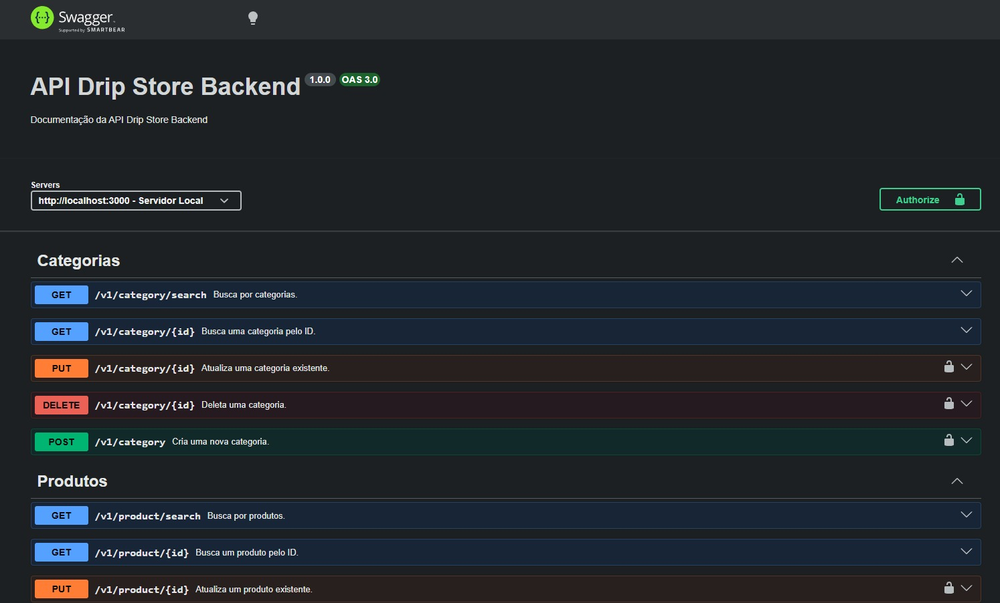

# 🛒 Projeto Final Geração Tech 3.0 - API Backend

Este repositório contém a infraestrutura de Back-end em **Node.js** desenvolvida como parte oficial do **Bootcamp Geração Tech 3.0** (Digital College). 

Esta API RESTful foi modernizada para utilizar **PostgreSQL (Supabase)** e segue uma arquitetura robusta de **MVC + Service Layer**, fornecendo o motor completo de catálogo de produtos, filtragem avançada de vitrine e sistema de segurança (Login JWT).

## 👥 Autores

**Weber Fernandes**  
GitHub: [weberfern](https://github.com/weberfern)  
Email: [weber12@gmail.com](mailto:weber12@gmail.com)

**Sandra Vasconcelos**  
GitHub: [SandraVasconcelos-74](https://github.com/SandraVasconcelos-74)  
Email: [sandrajulala@gmail.com](mailto:sandrajulala@gmail.com)

**Assis Sousa**  
GitHub: [assissousa](https://github.com/assissousa)  
Email: [assispsousa@gmail.com](mailto:assispsousa@gmail.com)

---

## 🛠️ Tecnologias Utilizadas
- **Node.js & Express:** Servidor back-end e gerenciamento de rotas.
- **Sequelize ORM & PostgreSQL (Supabase):** Modelagem de dados e persistência em nuvem.
- **Service Layer:** Camada de abstração para lógica de negócio complexa e transações SQL.
- **JSON Web Token (JWT) & Bcrypt:** Autenticação segura e proteção de rotas privadas.
- **Dotenv:** Gerenciamento de segredos e variáveis de ambiente.
- **Swagger:** Documentação interativa da API (`/api-docs`).
- **Jest & Supertest:** Suíte de testes automatizados (Integration Tests).

---

## 📂 Arquitetura de Pastas (MVC + Services)
O projeto utiliza o padrão Service Layer para manter os controllers limpos e focar a lógica de negócio em um único lugar:

```text
├── src/
│   ├── config/       # Configuração do banco de dados (PostgreSQL/SSL)
│   ├── controllers/  # Controladores (Lidando com req/res e status codes)
│   ├── middleware/   # Segurança e Validação (JWT Header)
│   ├── migrations/   # Histórico de banco de dados (Sequelize migrations)
│   ├── models/       # Entidades do sistema (PascalCase)
│   ├── routes/       # Definição das rotas e documentação Swagger
│   ├── services/     # Camada de Lógica de Negócio e Transações SQL
│   ├── app.js        # Setup do Express
│   └── server.js     # Inicialização do servidor
├── tests/            # Testes automatizados (Product, User, Category)
├── .env              # Configurações sensíveis
└── package.json      # Dependências e scripts
```

---

## 🚀 Como Rodar o Projeto

1. **Instale as dependências**:
```bash
npm install
```

2. **Configuração do Banco de Dados (Supabase)**:
O projeto foi migrado de MySQL para **PostgreSQL**. Crie um arquivo `.env` na raiz conforme o modelo:
```env
DB_HOST=seu-projeto.supabase.co
DB_USER=postgres
DB_PASSWORD=sua-senha
DB_NAME=postgres
DB_PORT=6543
JWT_SECRET=SuaChaveSecreta
JWT_EXPIRES_IN=1d
```

3. **Rode as Migrations**:
```bash
npx sequelize-cli db:migrate
```

4. **Inicie o Servidor**:
```bash
npm run dev
```
Acesse `http://localhost:3000/v1/status` para validar a conexão.

---

## 📖 Documentação Interativa (Swagger)
A documentação completa das rotas, payloads e status codes pode ser acessada em:
`http://localhost:3000/api-docs`

### 📸 Demonstração da API (Swagger UI)

<p align="center">
  
</p>

---

## 🧪 Testes Automatizados
O projeto conta com uma suíte de testes robusta. Para rodar todos os 24 testes:
```bash
npm test
```
*Certifique-se de que a conexão com o banco de teste no Supabase está ativa.*

---

## 📸 Demonstração de Respostas (Postman)

### Visualização de Usuário (Senha Criptografada)
<p align="center">
  
</p>

### Token JWT Gerado
<p align="center">
  
</p>

### Proteção JWT (400 Bad Request)
<p align="center">
  
</p>

### Erro de Autorização (Token Validado)
<p align="center">
  
</p>

---

<p align="center">Desenvolvido durante o Bootcamp Geração Tech 3.0 (Digital College).</p>
